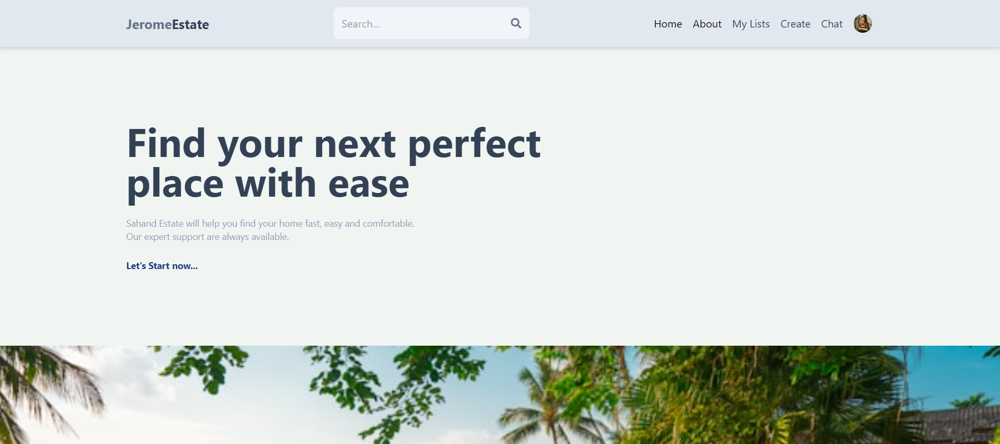
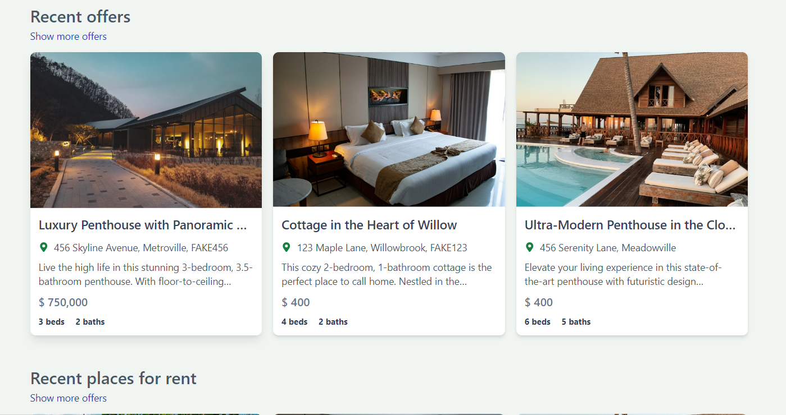
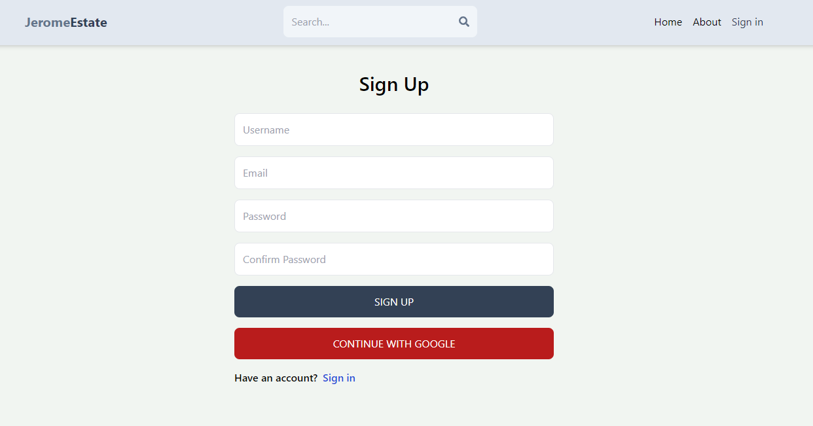
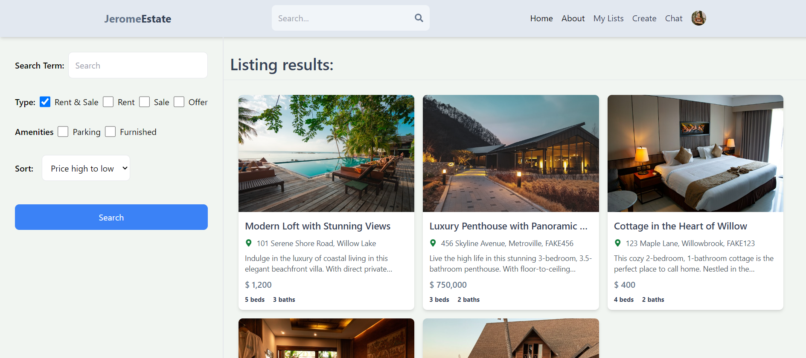
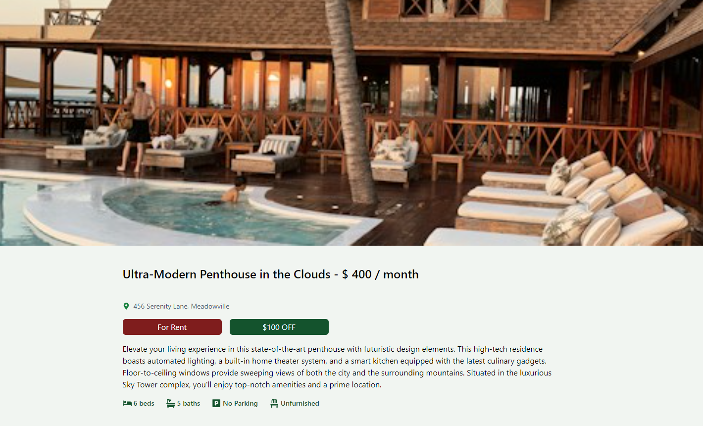
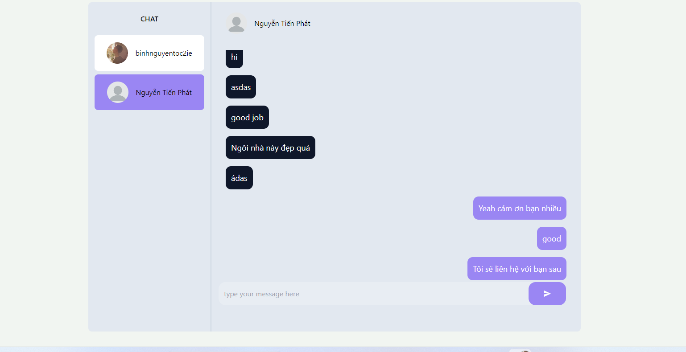
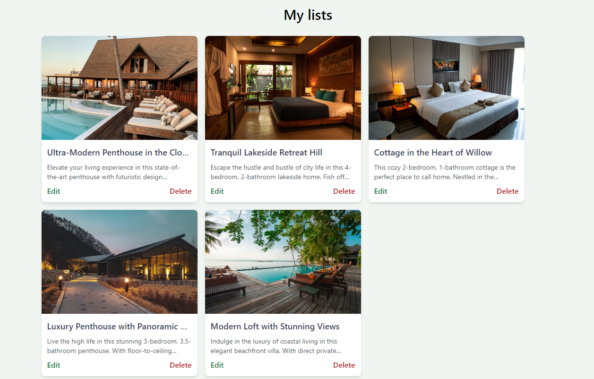

# Real Estate Marketplace

This is a web application for a real estate marketplace built using React, Node.js, and MongoDB.



## Features

- User registration and authentication
  
- Property listing and search
  
- Property details and image gallery
  
- Contact form for property inquiries
  
- User dashboard for managing listings and inquiries
  

## Technologies Used

- React: A JavaScript library for building user interfaces
- Node.js: A JavaScript runtime environment for server-side development
- MongoDB: A NoSQL database for storing property data
- Express: A web application framework for Node.js
- Mongoose: An Object Data Modeling (ODM) library for MongoDB
- HTML: Markup for the application
- Taiwindcss: A CSS framework for responsive web design
- Fuse.JS: Effective search function in our application
- Redux: to store user information
- Jsonwebtoken: authenticate user
- Socket.io: Chat realtime

## Installation

1. Clone the repository:

   ```bash
   git clone https://github.com/nguyentobinh12x5/Real-Estate-Market.git
   ```

2. Start
   api: npm run dev
   client: cd client => npm run dev
